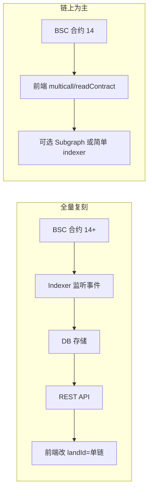

# 单链 BSC 复刻 Evolution Land 方案

## 一、现状对比

- **官方 Evolution Land**：多链（多大陆 = 多链），前端通过 `landId` 选链，依赖 **后端 REST API**（`REACT_APP_API_HOST`）和 **@evolutionland/evolution-js** 的 `bundleApi[landId]` 按链取合约地址。
- **你当前项目**：`[src/constants/contracts.js](src/constants/contracts.js)` 已配置 **单链 BSC 测试网**，共 **14 个合约地址**；前端仅用 RPC + multicall，**无后端**。地图、拍卖（创世 1–20）等已能跑。

---

## 二、合约数量与清单

你当前已列出的合约（约 **14 个**）与「功能一致」所需基本一致，单链 BSC 复刻不需要更多「合约种类」，只需保证每个角色一个地址即可：

| 类型       | 合约                                  | 说明                     |
| -------- | ----------------------------------- | ---------------------- |
| 代币       | RING, GOLD, WOOD, WATER, FIRE, SOIL | 1 个 RING + 5 种资源 ERC20 |
| NFT / 核心 | Land, Drill, Apostle                | 地块、钻头、使徒 ERC721        |
| 玩法       | Mining, Auction                     | 挖矿、拍卖（含时钟拍卖等）          |
| 其它       | Initializer, Referral, Blindbox     | 初始化、推荐、盲盒              |

若要做**农场（Farm）或治理（Gov）**，才需要再部署 Staking / Governor 等合约；官方多链里这些是按大陆配置的，单链 BSC 只需一套。

- **结论**：功能与官方对齐的「单链 BSC 版」合约数约 **14 个**（不含 Farm/Governance 则你已有）；若加 Farm/Governance，再加 1～2 个合约即可。

---

## 三、是否需要后端与数据库

**需要。** 若要做到和官方「功能一样」的列表/筛选/排序/排名，**必须有一个“索引层”**，要么是后端 + 数据库，要么是 The Graph 等索引服务。

原因简述：

- 官方前端**几乎所有列表/详情**都来自 **REST API**，而不是直接链上查：
  - 地块列表/详情：`/api/lands`、`/api/land?token_id=`
  - 地块排名：`/api/land/rank`
  - 使徒列表/详情：`/api/apostle/list`、`/api/apostle/info`
  - 钻头列表/详情/图鉴：`/api/furnace/props`、`/api/furnace/prop`、`/api/furnace/illustrated`
  - 农场 APR：`/api/farm/apr`
  - 其它：`/api/common/time`、`/api/pve/metadata` 等
- 链上只能按 `tokenId` 单查或对「已知 id 列表」做 multicall；**无法**在链上做「按价格/属性排序、分页、复杂筛选」的 1 万地块市场。
- 因此：**和官方一样的“市场 + 排名 + 图鉴 + 农场数据”** → 必须有一层把链上事件索引成可查询的数据，即 **后端 + 数据库** 或 **Subgraph**。

可选两种形态：

1. **后端 + 数据库（推荐，和官方一致）**
  - 跑一个 **Indexer**：监听 Land/Drill/Apostle/Auction/Mining 等合约的 **事件**（Transfer, AuctionCreated, Bid, 等），写入数据库。  
  - 再提供一套与官方 **接口兼容** 的 REST API（见下）。  
  - 这样可以直接复用/改造官方前端的 `hooks/backendApi` 调用（如 `useGetLandsList`、`useGetLand`、`useGetLandRank` 等），实现「功能一摸一样」。
2. **The Graph Subgraph**
  - 为 BSC 上的上述合约写 **Subgraph**，用 GraphQL 提供「列表/筛选/排序」。  
  - 前端需改写成调 GraphQL 而非 REST；功能可对齐，但和官方前端的接口形态不同，需要自己对接。

下面按「后端 + 数据库」方案说明，因为和官方前端最容易对齐。

---

## 四、后端要提供什么（与官方对齐）

以下接口与官方 [evo-frontend 的 backendApi](evo-frontend-official/src/hooks/backendApi/) 一致，单链 BSC 只需一套（无需 `EVO-NETWORK` 多链头）：

- **GET /api/common/time** — 服务器时间（可选）
- **GET /api/land** — 单地块详情：`token_id` → land_data + resource + auction + record
- **GET /api/lands** — 地块列表：分页、筛选（secondhand/all/genesis/my/bid/onsale/…）、排序（价格/属性等）
- **GET /api/land/rank** — 地块排名
- **GET /api/apostle/info** — 单使徒详情
- **GET /api/apostle/list** — 使徒列表（分页、筛选、排序）
- **GET /api/furnace/props** — 钻头列表
- **GET /api/furnace/prop** — 单钻头详情
- **GET /api/furnace/illustrated** — 钻头图鉴
- **GET /api/farm/apr** — 农场 APR（若做 Farm）
- **GET /api/pve/metadata** — PVE 元数据（若做 PVE）

数据库建议表（或文档）：lands, land_auctions, land_resources, apostles, drills, illustrated_drills, (farm_snapshots / stakes)，等；由 Indexer 从链上事件和只读调用填充。

---

## 五、复刻的两种路径

### 路径 A：功能与官方「一摸一样」（推荐目标）

- **合约**：保持你当前 14 个 BSC 合约（或再加 Farm/Governance）。
- **后端 + 数据库**：
  - 选型：Node（Express/Nest）/ Go / Python 等均可；DB 用 PostgreSQL 或 MongoDB。
  - **Indexer**：订阅 BSC 上 Land、Auction、Drill、Apostle、Mining 等合约事件，解析后写入 DB（地块、拍卖、归属、钻头/使徒元数据等）。
  - **REST API**：实现上节列出的各接口，返回格式与官方 `backendApi` 的 types 一致（见 [backendApi/types.ts](evo-frontend-official/src/hooks/backendApi/types.ts)）。
- **前端**：
  - 在现有 [evo-land-frontend-main](src/) 上接这套 API（`REACT_APP_API_HOST` 指向你的后端），**去掉多链逻辑**（只保留一个 landId 或写死 BSC）。
  - 或：把官方 [evo-frontend](https://github.com/evolutionlandorg/evo-frontend) 克隆下来，改为单链 BSC（`bundleApi` 只暴露一个链的合约地址），并让所有 `useGetLandsList`、`useGetLand` 等指向你的后端。

这样得到的即是「单链 BSC、功能与官方一致」的复刻。

### 路径 B：链上为主、不做完整后端

- **合约**：仍为当前 14 个。
- **无通用后端**：不实现 `/api/lands` 等复杂列表接口。
- **前端**：
  - 地图、单地块详情、单拍卖、单钻头/使徒：继续用 **multicall / readContract**（你已在 [WorldMap.jsx](src/pages/WorldMap.jsx)、[useLandAuction.js](src/hooks/useLandAuction.js) 等这样用）。
  - 市场「列表」：要么只做「我的地块 / 最近 N 块」等简单列表（链上查）；要么接一个 **最小 Indexer**（只同步拍卖中的 tokenId + 价格）或 **Subgraph**，只提供「在售列表」的轻量接口，不做完整排序/复杂筛选。
- **差异**：市场无法做到官方那种「1 万地块按价格/属性筛选排序」的体验，但核心玩法（地图、地块、拍卖、钻头/使徒放置）可保留。

---

## 六、需要你确认的两点

1. **目标范围**
  - 是否必须「市场/排名/图鉴/农场」与官方完全一致？  
    - **是** → 必须做 **路径 A**（后端 + DB + 完整 API）。  
    - **否** → 可用 **路径 B**，用链上 + 可选小 Indexer/Subgraph 做简化市场。
2. **Farm / Governance**
  - 若需要农场质押、治理投票，需要在 14 个合约之外再部署对应合约，并在后端或 Subgraph 中增加 Farm/Governance 的索引与接口。

---

## 七、小结表

| 项目         | 数量/结论                                                                                                                     |
| ---------- | ------------------------------------------------------------------------------------------------------------------------- |
| 合约数量（核心玩法） | **14 个**（RING + 5 资源 + Land + Drill + Apostle + Mining + Auction + Initializer + Referral + Blindbox）；Farm/Governance 另加。 |
| 是否需要后端     | **要做成和官方一样**：**需要**。列表/排名/图鉴/农场等都依赖索引层。                                                                                   |
| 是否需要数据库    | **需要**。Indexer 把链上事件和状态存库，API 再查库返回。                                                                                      |
| 其它         | 单链 BSC 只需一套合约地址、一套后端、一个 landId；前端去掉多链分支即可。                                                                                |

若你确认走「全量复刻」（路径 A），下一步可以细化：Indexer 要监听的合约事件列表、数据库表结构、以及每个 API 的请求/响应格式与官方 types 的对应关系，便于你实现或交给后端同事实现。